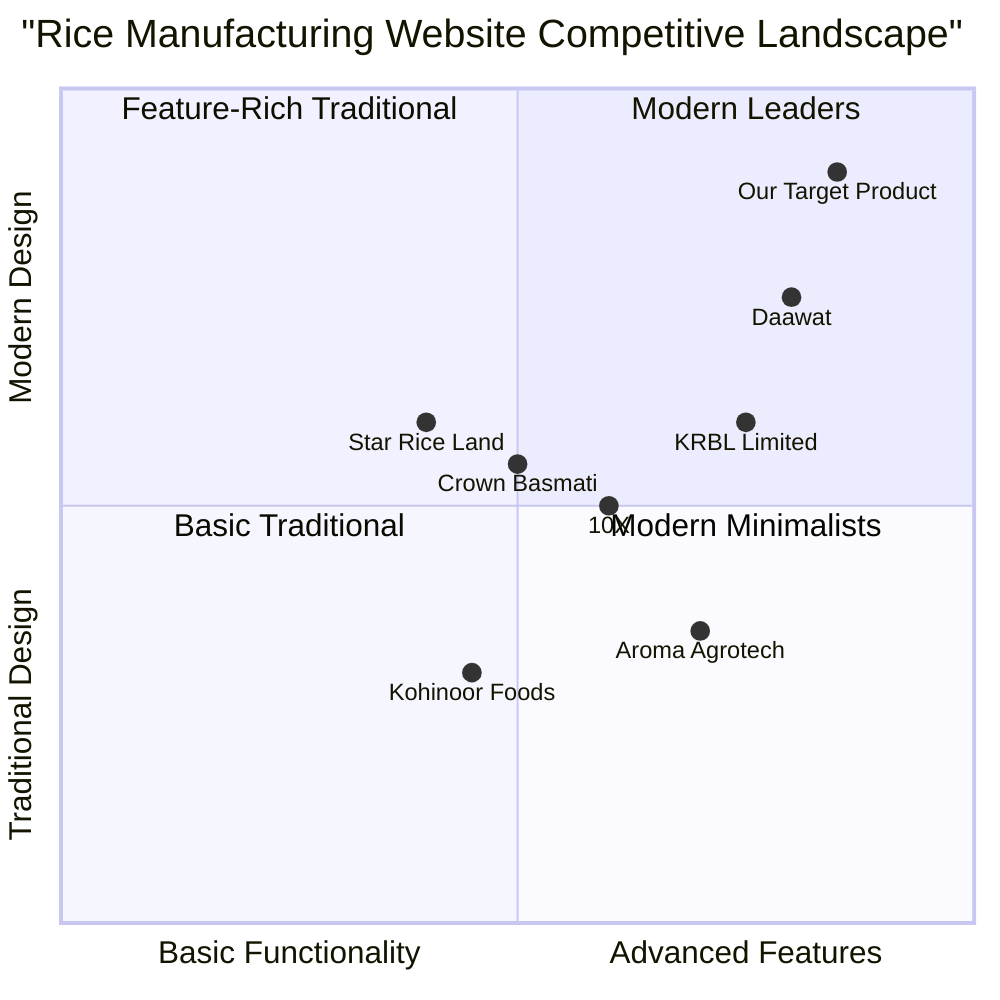

# Product Requirements Document: Annadaata Agro Industries Website

## Project Overview

**Project Name:** annadaata-agro-industries-landing-page
**Type:** Responsive Landing Page
**Brand Name:** Annadaata Agro Industries
**Brand Color:** Green
**Target Industry:** Rice Manufacturing

### Original Requirements

Create a rice manufacturing website landing page with the following specifications:

- Name: Annadaata Agro Industries
- Brand Color: Green
- Responsive design for all device screens
- Modular code with different sections and components
- Technology: NextJS with Tailwind CSS (latest app directory structure)
- UI Library: Shadcn UI
- Features: Animations and micro-interactions
- Typography: Different Google Fonts for different styling elements
- Icons: SVG format (placeholder for client replacement)
- Structured asset organization for Logo, Icons, etc.
- Modern and aesthetically pleasing UI with images (or placeholders)
- Clear project structure using NextJS

## Product Definition

### Product Goals

1. **Create a compelling brand presence** for Annadaata Agro Industries in the digital space that establishes credibility and trust in their rice manufacturing business
2. **Provide comprehensive information** about the company's rice products, production processes, quality standards, and sustainability practices to educate potential buyers and partners
3. **Generate quality leads and inquiries** from potential customers, distributors, and business partners through intuitive navigation and clear calls to action

### User Stories

1. **As a potential bulk buyer**, I want to quickly understand the range of rice products offered so that I can determine if they meet my purchasing requirements
2. **As a health-conscious consumer**, I want to learn about the production methods and quality standards so that I can make informed decisions about the rice I consume
3. **As a distributor or retailer**, I want to easily find contact information and business partnership details so that I can initiate a business relationship with the company
4. **As a mobile user**, I want the website to function smoothly on my device so that I can access information while on the go
5. **As an eco-conscious stakeholder**, I want to see the company's sustainability practices so that I can support environmentally responsible businesses

### Competitive Analysis

| Competitor                | Strengths                                                                                                    | Weaknesses                                                           |
| ------------------------- | ------------------------------------------------------------------------------------------------------------ | -------------------------------------------------------------------- |
| KRBL Limited (India Gate) | Strong brand recognition, comprehensive product catalog, elegant visuals, detailed certification information | Text-heavy pages, slower loading speed, limited mobile optimization  |
| Kohinoor Foods            | Clear value proposition, traditional aesthetic, multi-language support                                       | Outdated design, limited interactivity, complex navigation           |
| Daawat (LT Foods)         | Modern design, strong storytelling, product variety showcase, quality imagery                                | Dense information presentation, limited accessibility features       |
| Crown Basmati Rice        | Clean interface, good product visualization, certificate display                                             | Generic visuals, limited brand differentiation, basic animations     |
| Aroma Agrotech            | Detailed production process information, sustainability focus                                                | Cluttered layout, inconsistent branding, limited responsiveness      |
| 10X (GRM Overseas)        | International appeal, clean navigation, good use of white space                                              | Limited product storytelling, minimal animations, standard templates |
| Star Rice Land            | Visual-focused, quality photography, clear product categories                                                | Slow loading media, overwhelming homepage, complex user journey      |

### Competitive Quadrant Chart

## Technical Specifications

### Requirements Analysis

To fulfill the project needs, we need to develop a landing page with the following characteristics:

1. **Responsive Design**

   - Fully functional across all device sizes (mobile, tablet, desktop)
   - Fluid layouts that adapt to different screen dimensions
   - Touch-friendly interactive elements for mobile users

2. **Modern Frontend Stack**

   - Next.js (App Router) for optimized rendering and SEO
   - Tailwind CSS for responsive styling
   - Shadcn UI components for consistent design system
   - Animation (use GSAP)

3. **Visual Elements**

   - High-quality imagery showcasing rice products and production
   - Custom SVG icons for visual interest and brand identity
   - Animations and micro-interactions for engaging user experience

4. **Typography**

   - Strategic use of different Google Fonts for hierarchy and brand personality
   - Consistent type scale for readability across devices

5. **Project Structure**
   - Modular component architecture
   - Well-organized asset management
   - Separation of concerns for maintainability

### Requirements Pool

#### P0 (Must Have)

- **Landing Page Core Sections**

  - Hero section with compelling value proposition and imagery
  - Product showcase featuring different rice varieties
  - About company section highlighting heritage and values
  - Production process visualization
  - Contact information and inquiry form

- **Technical Implementation**
  - Complete Next.js app directory structure
  - Fully responsive design for all breakpoints
  - Shadcn UI component integration
  - Basic SEO optimization
  - Image optimization and lazy loading

#### P1 (Should Have)

- **Enhanced User Experience**

  - Subtle animations on scroll and hover
  - Micro-interactions on buttons and interactive elements
  - Testimonials or client showcase section
  - Quality certifications display
  - Sustainability practices section

- **Technical Enhancements**
  - Light mode only
  - Accessibility compliance (WCAG)
  - Performance optimization
  - Custom 404 page

### Project Architecture

### UI Design Draft

#### General Theme

- **Primary Color**: Green (brand color)
- **Secondary Colors**: Earth tones, cream, and gold (representing rice and agriculture)
- **Typography**:
  - Headings: "Playfair Display" (elegant serif font for traditional values)
  - Body text: "Inter" (clean sans-serif for readability)
  - Accents: "Montserrat" (modern sans-serif for buttons and highlights)

#### Layout Overview

1. **Header**

   - Fixed position for accessibility
   - Logo on left
   - Navigation links in center (on desktop)
   - Contact button on right
   - Hamburger menu for mobile

2. **Hero Section**

   - Full-width banner with farm/rice field background
   - Bold heading: "From Fields to Tables: Premium Rice by Annadaata"
   - Brief value proposition
   - CTA button: "Explore Our Products"
   - Subtle grain animations in background

3. **Products Showcase**

   - Grid layout with product cards
   - Each card featuring:
     - Product image
     - Rice variety name
     - Brief description
     - Common button to call us directly
   - Hover animations for cards

4. **About Us Section**

   - Two-column layout
   - Left: Storytelling content about company heritage
   - Right: Image of facility or founders
   - Animated statistics counters

5. **Production Process**

   - Horizontal timeline/steps visualization
   - Icons representing each production stage
   - Brief descriptions
   - Subtle animations when scrolling through steps

6. **Sustainability Practices**

   - Icon-based grid highlighting eco-friendly initiatives
   - Background with subtle green patterns
   - Animated infographics showing environmental impact

7. **Testimonials/Partners**

   - Carousel display
   - Client logos or testimonial cards
   - Auto-scrolling with pause on hover

8. **Contact Section**

   - Split layout
   - Left: Contact form with floating labels
   - Right: Contact information and map
   - Form submission animation

9. **Footer**
   - Logo
   - Quick navigation links
   - Social media icons
   - Copyright information

### Mobile Considerations

- Stack all columns vertically
- Collapsible navigation menu
- Touch-optimized carousel controls
- Larger touch targets for buttons
- Reduced animation complexity for performance

### Animation Specifications

1. **Micro-interactions**

   - Button hover/press effects
   - Form field focus states
   - Navigation link hover effects
   - Card hover transformations

2. **Scroll Animations**

   - Fade-in elements as user scrolls
   - Parallax effects on hero images
   - Counter animations for statistics
   - Sequential revealing of process steps

3. **Loading States**

   - Form submission animations
   - Page transition effects
   - Image loading skeletons

4. **Content Requirements**

   - Rice Varieties: 1. Minikit Rice 2. Swarna Rice (Bodhana Rice)3. Kuruva Rice 4. IR - 36 Rice 5. Banshkathi Rice 6. 10-10 Rice. 7. Gobindobhog Rice (Jeerakhasala Rice )
   - Jeerakhasala is the flagship product
   - Use stock image for now. I will link the images later. Create a constant file for images. I will update the images later.

5. **Business Goals**

   - the primary goal is lead generation, brand awareness.

6. **Technical Considerations**

   - Make sure the site is fast and most important it is SEO firendly.
   - Focus on SEO a lot. Make sure I can edit the SEO manually. Keep the SEO config in a single place so that its easy to update.

7. **Company Details**
   - Contact - +919064389085, +919832170531
   - Email: industries.annadaataagro@gmail.com
   - Business Hours: Monday to Sunday 9am to 8pm
   - Address - Baharampur , Shyamsundar , Bardhaman - 713424 , West Bengal , India
